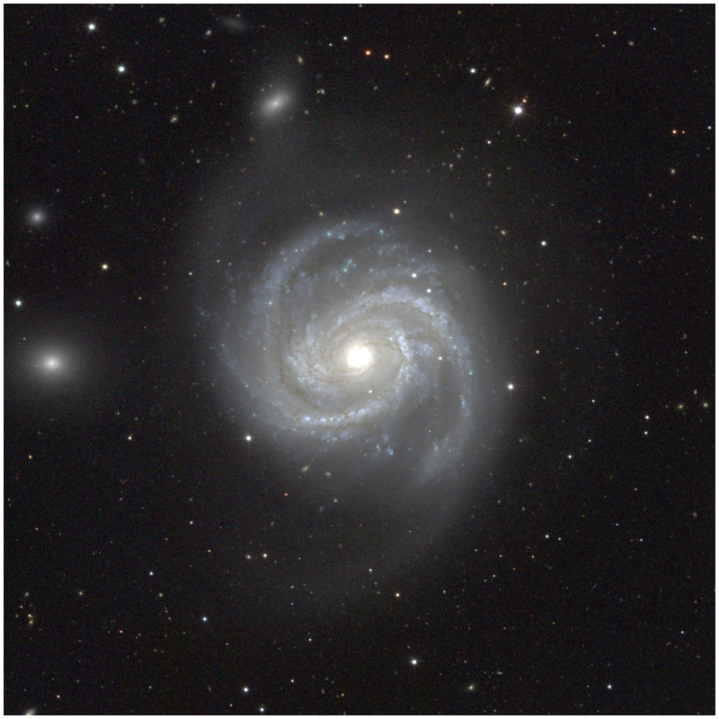
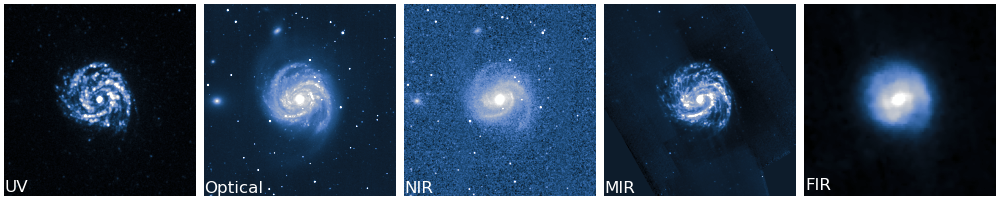

# Multiwavelength Photometry Tutorials

[](https://github.com/Astronoray/DustPedia_SEDFitting "Go to GitHub repo")

[](https://www.python.org/) [](https://www.astropy.org/) [](https://astroquery.readthedocs.io/en/latest/) [](https://dust-extinction.readthedocs.io/en/latest/) [](https://www.matplotlib.org/) [](https://www.numpy.org/) [](https://photutils.readthedocs.io/en/stable/) [](https://www.scipy.org/) 




This respository serves as a series of undergraduate-level tutorial notebooks for working with multiwavelength imaging of the **Mirror Galaxy**, also known as M100 or NGC 4321. The tutorials will walk through a complete analysis path starting from preparing the multiwavelength images all the way through measuring surface brightness profiles and using SED-fitting codes like CIGALE. These notebooks are designed for students who have some Python experience but are new to astronomical image analysis. 

## Scientific Goal

Galaxies emit light across the electromagnetic spectrum. Different wavelengths trace different physical components:



- **Ultraviolet** light traces young, massive stars and recent star formation. 
- **Optical** light traces a mixture of young stars, old stars, dust lanes, and star-forming regions. 
- **Near-infrared** light is less affected by dust and traces the older stellar populations. 
- **Mid-infrared** light traces warm dust and PAH emission.
- **Far-infrared** light traces colder dust heated by stars. 

By combining many wavelengths, we can build a spectral energy distribution, or **SED**, for the galaxy. This SED can then be modeled with tools like **CIGALE** to estimate galaxy properties such as stellar mass, star formation rate, dust attenuation, and dust luminosity. 

## Tutorial Notebooks

The notebooks should be run in order. 

1. `01_BkgSub.ipynb`: Background subtraction and masking. This notebook loads in the images and corrects them for several factors: Milky Way extinction, nearby stars, and the image background.
2. `02_SurfaceBrightness.ipnyb`: Surface brightness profiles and bulge+disk fitting. This notebook measures radial profiles of the galaxy. 
3. `03_AperturePhotometry.ipnyb`: Aperture photometry for SED fitting. This notebook measures integrated fluxes for the galaxy as well as uncertainties. 
4. `04_UnderstandingCIGALE.ipnyb`: Running and interpreting CIGALE. This notebook introduces CIGALE and explains how to interpret its outputs. 

## Data

The imaging data are not included in this repository because the FITS files are too large for GitHub. The data used in these tutorials come from the **DustPedia Archive**: https://dustpedia.astro.noa.gr/. DustPedia provides multiwavelength imagery and photometry for nearby galaxies. More information about DustPedia can be found in [Davies et al. (2017)](https://scixplorer.org/abs/2017PASP..129d4102D/abstract) and [Clark et al. (2018)](https://scixplorer.org/abs/2018A%26A...609A..37C/abstract).

For this project,  we use the images for NGC 4321 in the following bands: 
- GALEX: FUV and NUV
- SDSS: u, g, r, i, and z
- 2MASS: J, H, and Ks
- Spitzer: IRAC1, IRAC2, IRAC3, IRAC4, MIPS24, MIPS70, and MIPS160
- WISE: W1, W2, W3, and W4

## Directory Structure

After downloading the data, place the raw DustPedia images in a local directory. You will need to update the file paths inside the notebooks to this directory. 

A suggested structure, and the one used by this tutorial, is: 

```text
│
├─ README.md
│
├─ 01_BkgSub.ipynb
├─ 02_SurfaceBrightness.ipynb
├─ 03_AperturePhotometry.ipynb
├─ 04_UnderstandingCIGALE.ipynb
│
├─ NGC4321_Images/
│   ├─ NGC4321_2MASS_H.fits
│   ├─ NGC4321_2MASS_J.fits
│   ├─ NGC4321_2MASS_Ks.fits
│   ├─ NGC4321_GALEX_FUV.fits
│   ├─ ...
│   └─ NGC4321_WISE_22.fits
│
├─ NGC4321_BkgSub/
│   ├─ calibration_uncertainties.ecsv
│   ├─ extinction_corrections.ecsv
│   ├─ ...
│   └─ NGC4321_WISE_W4_bkgsub.fits
│
├─ NGC4321_Profiles/
│   ├─ NGC4321_sb_fitresults.ecsv
│   ├─ NGC4321_sb_imagetable.ecsv
│   └─ NGC4321_sb_profiles.ecsv
│
├─ NGC4321_AperturePhotometry/
│   ├─ NGC4321_aperphot_imagetable.ecsv
│   ├─ NGC4321_aperture_mask.ecsv
│   ├─ NGC4321_aperture_photometry.ecsv
│   └─ NGC4321_cigale_input.txt
│
├─ cigale_run/
│   ├─ NGC4321_cigale_input.txt
│   ├─ pcigale.ini
│   ├─ pcigale.ini.spec
│   └─ out/
│       ├─ results.fits
│       ├─ ...
│       └─ NGC4321_best_model.fits
```

## Downloading the DustPedia Images

1. Go to the DustPedia Archive: https://dustpedia.astro.noa.gr/
2. Search for NGC 4321 on page 43.
3. Download the FITS images for the bands listed above. This will take a while. 
4. Place the downloaded FITS files in
    ```text
    NGC4321_Images/
    ```
    or whatever you've called your data directory. 
5. Open `01_BkgSub.ipynb` and update the file paths in the image table so they match your local directory. 

## Creating Python Environments
These notebooks use common astronomy Python packages such as Astropy, Photutils, Astroquery, NumPy, SciPy, and Matplotlib. You can create a Python environment with Anaconda directly in the Terminal. 

Run: 
```bash
conda create -n ngc4321-tutorials python=3.11
conda activate ngc4321-tutorials

conda install -c conda-forge numpy scipy matplotlib astropy photutils astroquery dust_extinction jupyterlab ipykernel
```
After this, open the notebooks and use this environment in VisualStudioCode, for example, or Jupyter Lab. 

### CIGALE Installation

CIGALE is used during Notebook 4, but you should install CIGALE in a separate environment from the environment you're using for these notebooks. There's more detail about how to do this within Notebook 4. 

## Notes for Students

### What is a FITS file?

FITS stands for Flexible Image Transport System. It is the standard file format used by astronomers for images, spectra, and data tables. A FITS file usually contains a data array, a header with metadata, and sometimes multiple extensions contains tables, uncertainty arrays, etc. The header usually contains image units, telescope information, and WCS information. 

### What is WCS?
I hear you. WCS stands for World Coordinate System. It tells a program like Python how to convert between pixel coordinates and the sky coordinates Right Ascension (RA) and Declination (Dec). 

### What is SED fitting?
SED fitting compares observed fluxes across many wavelengths to physical model spectra. For example, CIGALE combines models for star formation history, stellar populations, gas emission, dust attenuation, dust emission, AGN features, and redshifting. 

The result is an estimate of galaxy physical properties, but those estimates will naturally depend on the model assumptions. 

### Suggested Workflow

1. Clone or download this repository. 
2. Create the conda environment. 
3. Download the DustPedia images for NGC 4321. 
4. Place the images in `NGC4321_Images/`.
5. Open `01_BkgSub.ipynb`.
6. Update the file paths to match the downloaded images. 
7. Run Notebook 1 slowly, checking each plot. 
8. Run Notebook 2 and inspect the radial profiles. 
9. Run Notebook 3 and inspect the aperture plots. 
10. Install CIGALE in a separate environment. 
11. Use the CIGALE input file from Notebook 3. 
12. Run CIGALE from the command line. 
13. Use Notebook 4 to inspect and interpret the results. 

## Acknowledgements

This tutorial series uses data from the DustPedia Archive and standard open-source astronomy tools including Astropy, Photutils, Astroquery, and CIGALE. 

Useful links: 
- DustPedia Archive: https://dustpedia.astro.noa.gr/
- CIGALE: https://cigale.lam.fr/
- Astropy: https://www.astropy.org/
- Photutils: https://photutils.readthedocs.io/en/stable/
- Astroquery: https://astroquery.readthedocs.io/en/latest/
- Matplotlib: https://matplotlib.org/

